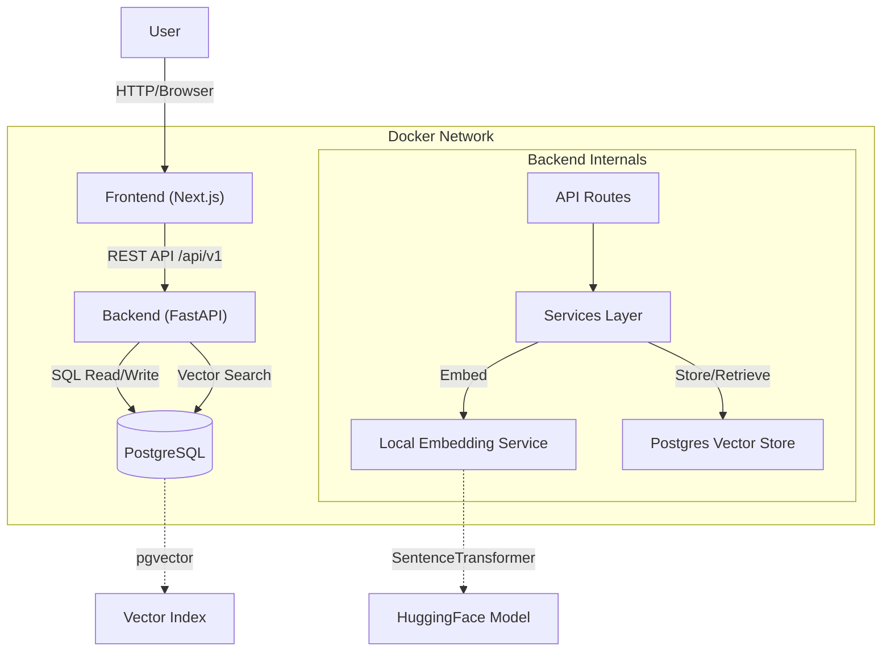

# FixFlow Architecture

This document outlines the high-level architecture of FixFlow.

## System Overview

FixFlow is a 3-tier application:
1.  **Frontend**: Next.js (React) Application
2.  **Backend**: FastAPI (Python) Service
3.  **Database**: PostgreSQL with `pgvector` extension

## Component Diagram

## Data Flow

### 1. Issue Submission (Write)
1.  User submits form (Title, Content, Solution).
2.  Frontend calls `POST /issues`.
3.  Backend receives data.
4.  **Embedding Service** converts (Title + Content + Solution) into a 384-dimensional vector.
5.  **Vector Store Service** saves the JSON metadata and the Vector to PostgreSQL.

### 2. Semantic Search (Read)
1.  User types query (e.g., "timeout error").
2.  Frontend calls `POST /search`.
3.  Backend converts query to vector.
4.  **Vector Store Service** performs Cosine Similarity search in PostgreSQL using `pgvector`.
5.  Top K results returned to User.
