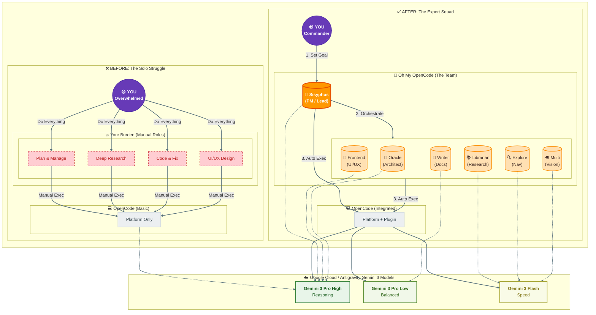

```mermaid
graph TB
    %% ==========================================
    %% ■ STYLING (Modern & Clean) ■
    %% ==========================================
    classDef user fill:#673ab7,stroke:#512da8,stroke-width:2px,color:white,font-weight:bold
    classDef platform fill:#eceff1,stroke:#cfd8dc,stroke-width:2px,color:#37474f
    classDef burden fill:#ffcdd2,stroke:#c62828,stroke-width:2px,stroke-dasharray: 5 5,color:#b71c1c
    classDef pm fill:#ff9800,stroke:#e65100,stroke-width:3px,color:white,font-weight:bold
    classDef agent fill:#ffe0b2,stroke:#fb8c00,stroke-width:2px,color:#3e2723
    classDef proHigh fill:#e8f5e9,stroke:#2e7d32,stroke-width:2px,color:#1b5e20
    classDef proLow fill:#f1f8e9,stroke:#558b2f,stroke-width:2px,color:#33691e
    classDef flash fill:#f9fbe7,stroke:#9e9d24,stroke-width:2px,color:#827717

    %% ==========================================
    %% ■ MAIN CONTAINER (Left vs Right) ■
    %% ==========================================
    subgraph Comparison_Layout [ ]
        direction LR

        %% ==========================================
        %% ■ LEFT COLUMN: BEFORE (Manual Chaos) ■
        %% ==========================================
        subgraph Before_Column ["❌ BEFORE: The Solo Struggle"]
            direction TB
            
            UserBefore((😫 YOU<br>Overwhelmed)):::user
            
            subgraph Manual_Layer ["💥 Your Burden (Manual Roles)"]
                direction TB
                subgraph Manual_Tasks [ ]
                    direction LR
                    M_PM[Plan & Manage]:::burden
                    M_Res[Deep Research]:::burden
                    M_Code[Code & Fix]:::burden
                    M_Des[UI/UX Design]:::burden
                end
            end

            subgraph Tool_Solo ["💻 OpenCode (Basic)"]
                Opencode1[Platform Only]:::platform
            end

            %% Flows
            UserBefore -- "Do Everything" --> M_PM & M_Res & M_Code & M_Des
            M_PM & M_Res & M_Code & M_Des -- "Manual Exec" --> Opencode1
        end

        %% ==========================================
        %% ■ RIGHT COLUMN: AFTER (Agent Team) ■
        %% ==========================================
        subgraph After_Column ["✅ AFTER: The Expert Squad"]
            direction TB
            
            UserAfter((😎 YOU<br>Commander)):::user
            
            subgraph Agent_Layer ["🚀 Oh My OpenCode (The Team)"]
                direction TB
                
                %% The Boss
                Sisyphus[("<b>🎩 Sisyphus</b><br>(PM / Lead)")]:::pm

                %% The Subordinates (Grouped for alignment)
                subgraph Squad [ ]
                    direction LR
                    Oracle[("🧠 Oracle<br>(Architect)")]:::agent
                    Librarian[("📚 Librarian<br>(Research)")]:::agent
                    Frontend[("🎨 Frontend<br>(UI/UX)")]:::agent
                    Explore[("🔍 Explore<br>(Nav)")]:::agent
                    DocWriter[("📝 Writer<br>(Docs)")]:::agent
                    Multi[("👁️ Multi<br>(Vision)")]:::agent
                end
            end

            subgraph Tool_Team ["💻 OpenCode (Integrated)"]
                Opencode2[Platform + Plugin]:::platform
            end

            %% Flows
            UserAfter -- "1. Set Goal" --> Sisyphus
            Sisyphus -- "2. Orchestrate" --> Squad
            Sisyphus & Squad -- "3. Auto Exec" --> Opencode2
        end
    end

    %% ==========================================
    %% ■ BOTTOM: MODEL INFRASTRUCTURE (Shared) ■
    %% ==========================================
    subgraph Cloud ["☁️ Google Cloud / Antigravity Gemini 3 Models"]
        direction LR
        ProHigh[<b>Gemini 3 Pro High</b><br>Reasoning]:::proHigh
        ProLow[<b>Gemini 3 Pro Low</b><br>Balanced]:::proLow
        Flash[<b>Gemini 3 Flash</b><br>Speed]:::flash
    end

    %% Wiring to Models
    Opencode1 -.-> ProHigh
    Opencode2 ===> ProHigh & ProLow & Flash

    %% Virtual mapping for clarity (Optional visual aid)
    Sisyphus -.-> ProHigh
    Frontend -.-> ProHigh
    Oracle -.-> ProHigh
    DocWriter -.-> ProLow
    Librarian -.-> Flash
    Explore -.-> Flash
    Multi -.-> Flash

    %% Link Styling
    linkStyle default stroke-width:2px,fill:none,stroke:#546e7a
```