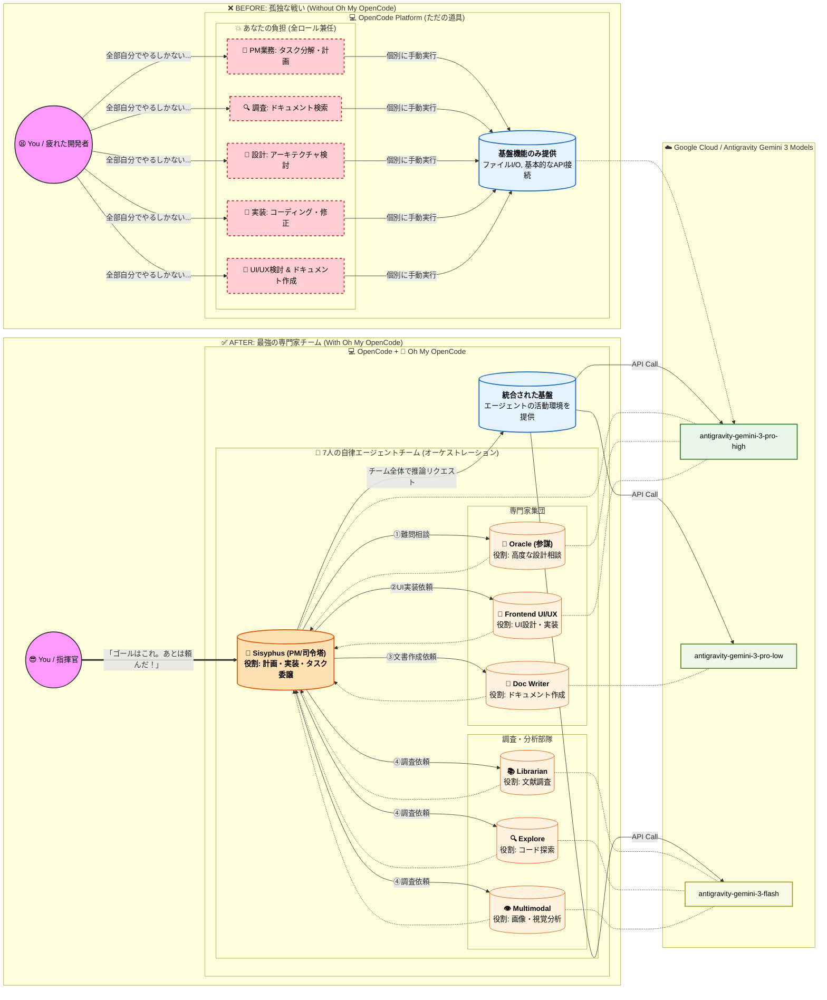

```mermaid
graph LR
    %% ■■■ スタイル定義 ■■■
    classDef user fill:#f9f,stroke:#333,stroke-width:2px,color:black
    classDef platform fill:#e3f2fd,stroke:#1565c0,stroke-width:2px,color:black
    classDef burden fill:#ffcdd2,stroke:#c62828,stroke-width:2px,stroke-dasharray: 5 5,color:black
    classDef team fill:#fff9c4,stroke:#fbc02d,stroke-width:3px,color:black
    classDef agent fill:#fff3e0,stroke:#e65100,stroke-width:1px,color:black
    classDef pm fill:#ffe0b2,stroke:#e65100,stroke-width:2px,font-weight:bold,color:black
    classDef proHigh fill:#e8f5e9,stroke:#2e7d32,stroke-width:2px,color:black
    classDef proLow fill:#f1f8e9,stroke:#558b2f,stroke-width:2px,color:black
    classDef flash fill:#f9fbe7,stroke:#9e9d24,stroke-width:2px,color:black

    %% ■■■ 左側：Without Oh My OpenCode ■■■
    subgraph Without ["❌ BEFORE: 孤独な戦い (Without Oh My OpenCode)"]
        direction TB
        UserBefore((😫 You / 疲れた開発者)):::user
        
        subgraph OpenCode_Solo ["💻 OpenCode Platform (ただの道具)"]
            direction TB
            PlatformDescBefore[("<b>基盤機能のみ提供</b><br>ファイルI/O, 基本的なAPI接続")]:::platform
            
            subgraph Manual_Work ["💥 あなたの負担 (全ロール兼任)"]
                direction TB
                Task1["🤔 PM業務: タスク分解・計画"]:::burden
                Task2["🔍 調査: ドキュメント検索"]:::burden
                Task3["🧠 設計: アーキテクチャ検討"]:::burden
                Task4["📝 実装: コーディング・修正"]:::burden
                Task5["🎨 UI/UX検討 & ドキュメント作成"]:::burden
            end
        end

        %% ユーザーの負担フロー
        UserBefore -- "全部自分でやるしかない..." --> Task1 & Task2 & Task3 & Task4 & Task5
        Task1 & Task2 & Task3 & Task4 & Task5 -- "個別に手動実行" --> PlatformDescBefore
    end

    %% ■■■ 右側：With Oh My OpenCode ■■■
    subgraph With ["✅ AFTER: 最強の専門家チーム (With Oh My OpenCode)"]
        direction TB
        UserAfter((😎 You / 指揮官)):::user

        subgraph OpenCode_Team ["💻 OpenCode + 🚀 Oh My OpenCode"]
            direction TB
            PlatformDescAfter[("<b>統合された基盤</b><br>エージェントの活動環境を提供")]:::platform

            subgraph Agent_Team ["🤝 7人の自律エージェントチーム (オーケストレーション)"]
                direction TB
                
                %% PMエージェント
                Sisyphus[("<b>🎩 Sisyphus (PM/司令塔)</b><br>役割: 計画・実装・タスク委譲")]:::pm

                %% 専門家エージェントたち
                subgraph Specialists ["専門家集団"]
                    direction LR
                    Oracle[("<b>🧠 Oracle (参謀)</b><br>役割: 高度な設計相談")]:::agent
                    Frontend[("<b>🎨 Frontend UI/UX</b><br>役割: UI設計・実装")]:::agent
                    DocWriter[("<b>📝 Doc Writer</b><br>役割: ドキュメント作成")]:::agent
                end
                
                subgraph Researchers ["調査・分析部隊"]
                    direction LR
                    Librarian[("<b>📚 Librarian</b><br>役割: 文献調査")]:::agent
                    Explore[("<b>🔍 Explore</b><br>役割: コード探索")]:::agent
                    Multimodal[("<b>👁️ Multimodal</b><br>役割: 画像・視覚分析")]:::agent
                end

                %% 指示系統 (オーケストレーション)
                Sisyphus -- "①難問相談" --> Oracle
                Sisyphus -- "②UI実装依頼" --> Frontend
                Sisyphus -- "③文書作成依頼" --> DocWriter
                Sisyphus -- "④調査依頼" --> Librarian & Explore & Multimodal
                
                %% 成果物の報告
                Oracle & Frontend & DocWriter & Librarian & Explore & Multimodal -.-> Sisyphus
            end
        end
        
        %% ユーザーの楽なフロー
        UserAfter == "「ゴールはこれ。あとは頼んだ！」" ==> Sisyphus
        Sisyphus -- "チーム全体で推論リクエスト" --> PlatformDescAfter
    end

    %% ■■■ 下部：使用モデル (Cloud) ■■■
    subgraph Cloud ["☁️ Google Cloud / Antigravity Gemini 3 Models"]
        direction LR
        ProHigh[antigravity-gemini-3-pro-high]:::proHigh
        ProLow[antigravity-gemini-3-pro-low]:::proLow
        Flash[antigravity-gemini-3-flash]:::flash
    end

    %% モデルとの接続 (Before - 手動接続のイメージは省略してシンプルに)
    PlatformDescBefore -.-> ProHigh

    %% モデルとの接続 (After - エージェントごとの割り当て)
    PlatformDescAfter -- "API Call" --> ProHigh & ProLow & Flash

    %% どのエージェントがどのモデルを使うか（概念的な紐付け）
    Sisyphus & Oracle & Frontend -.- ProHigh
    DocWriter -.- ProLow
    Librarian & Explore & Multimodal -.- Flash
```